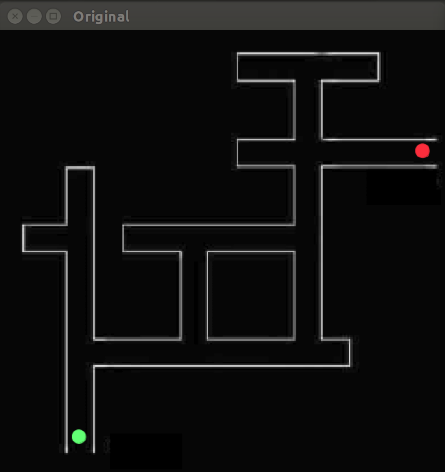
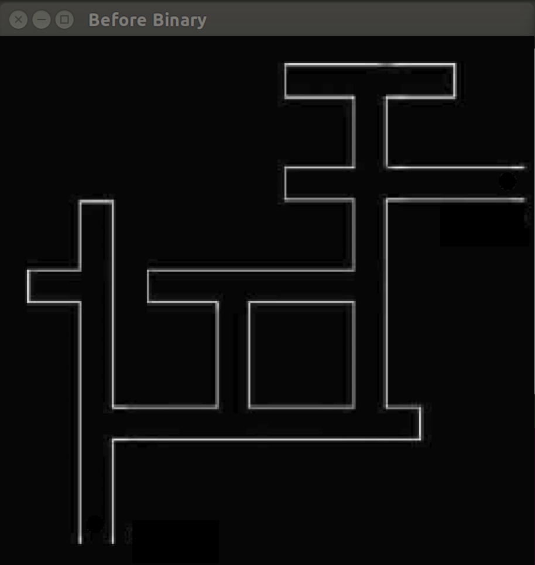
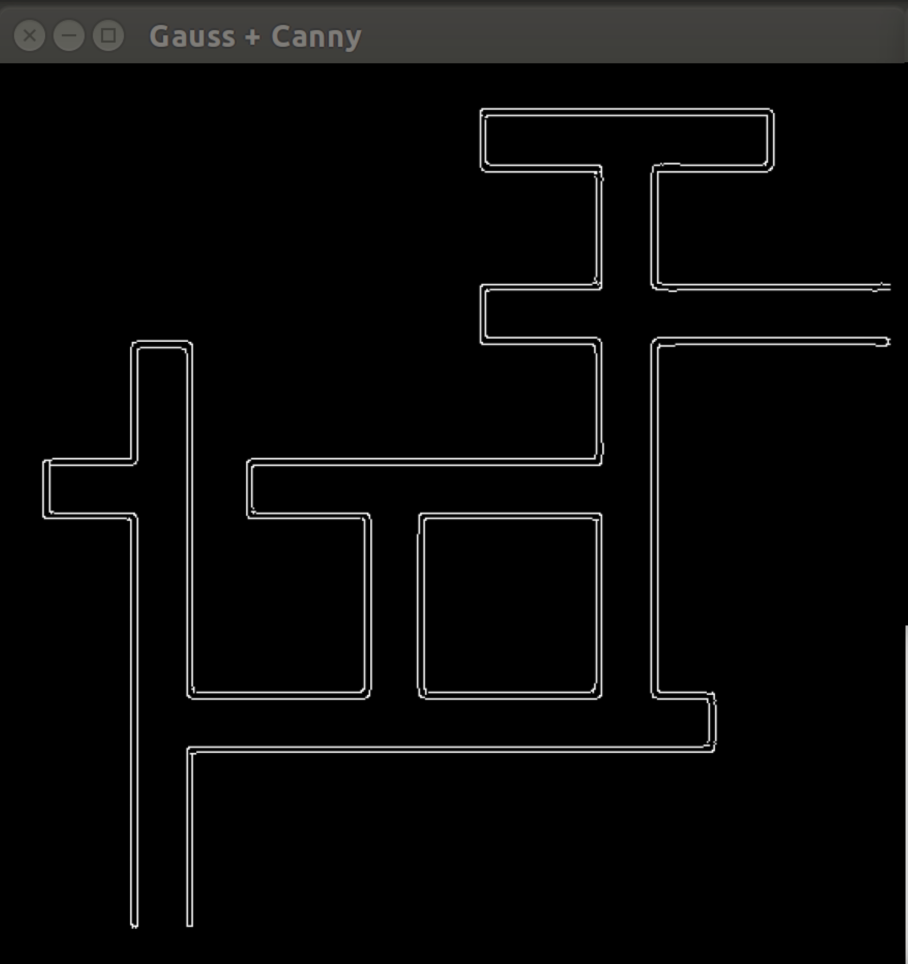
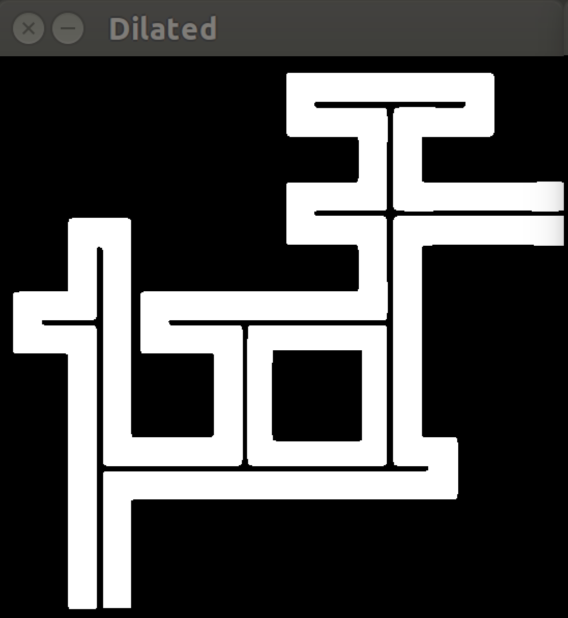
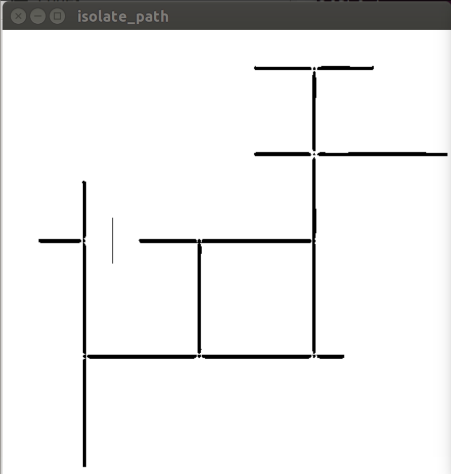
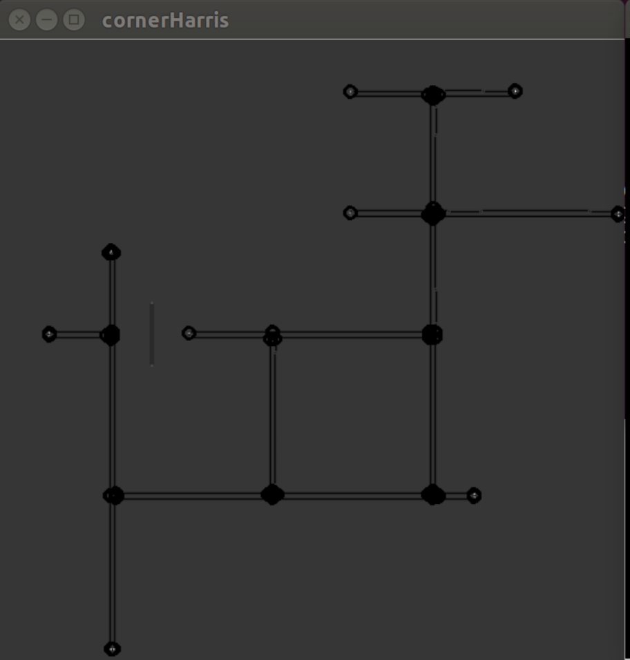
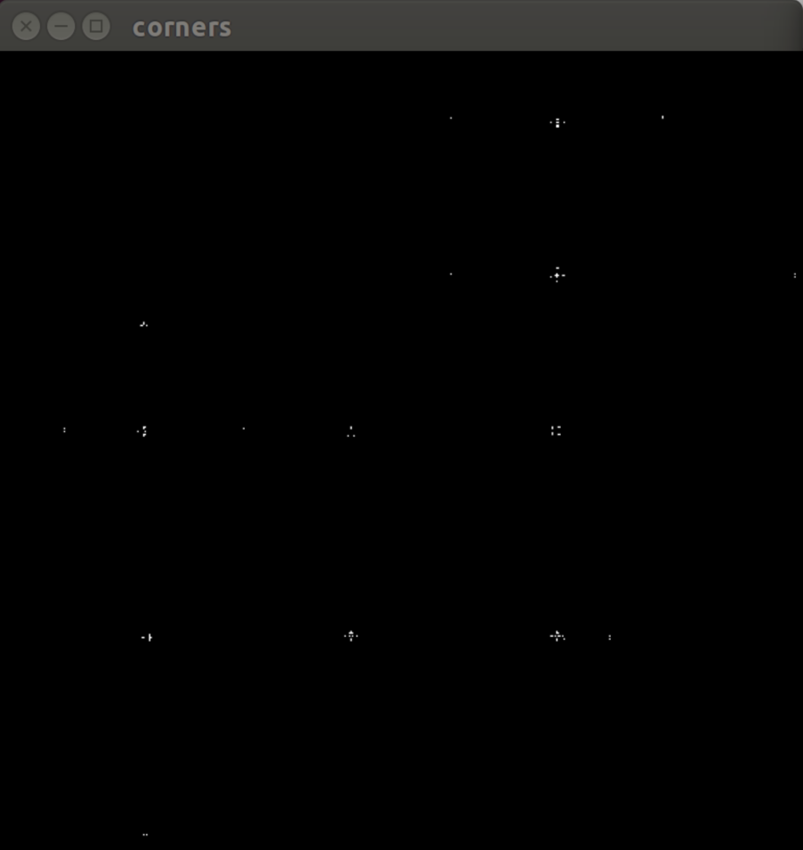
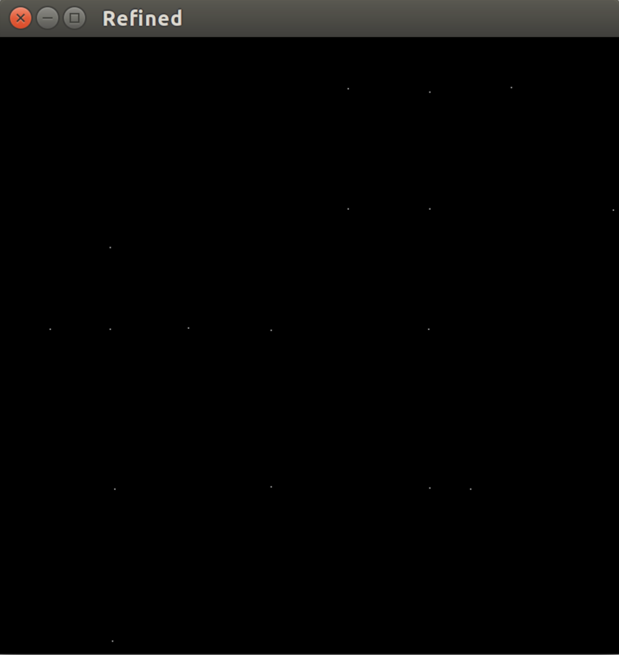

# Maze-Traversing-Bot
The code to guide a bot through a maze from a live overhead camera feed
=======

We use basic computer vision and openCV based image processing to identify the maze, localise the bot in the maze, create a graph on the maze and apply Dijkstra's algorithm to find out the shortest path from start to finish.

This is a sample schematic of the maze
<h1 align="center">
	
	 
	 
</h1>

First we identify and store the locations of the start (green) and destination (red). We remove their spots, and convert the image to binary black & white.
<h1 align="center">
	
	 
	 
</h1>

We apply Gaussian blur and Canny filter.
<h1 align="center">
	
	 
	 
</h1>

We find and draw the contours in a new image, and dilate it to make the path narrower and more precise.
<h1 align="center">
	
	 
	 
</h1>

Then we isolate the actual path.
<h1 align="center">
	
	 
	 
</h1>

Then we apply the cornerHarris function to find the corners in the maze, which will be the vertices of our graph.
<h1 align="center">
	
	 
	 
</h1>
<h1 align="center">
	
	 
	 
</h1>

cornerHarris isn't perfect, so we refine it by cleaning up the clusters of corners detected.
<h1 align="center">
	
	 
	 
</h1>

Then we make a graph with these corners as vertices and make edges between vertices which don't have a wall in between in the maze.

Finally, we apply Dijkstra's algorithm on this graph (using the start and destination coordinates stored in the beginning) and get the shortest path.
<h1 align="center">
	
	 
	 
</h1>